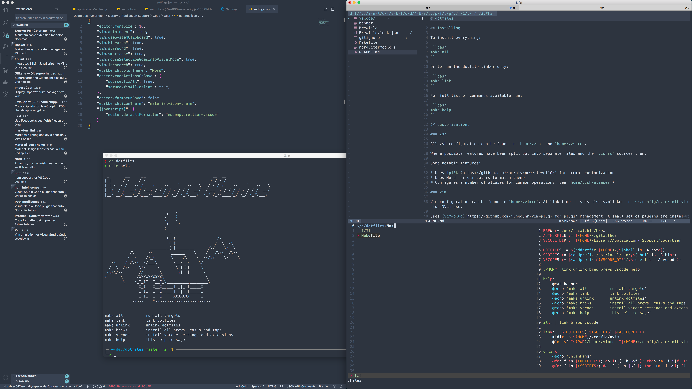

# dotfiles



## Installing

To install everything:

```bash
make all
```

Or to run the dotfile linker only:

```bash
make link
```

For full list of commands available run:

```bash
make help
```

## Customizations

### Zsh

All zsh configuration can be found in `home/.zsh` and `home/.zshrc`.

Where possible features have been split out into separate files and the `.zshrc`
sources them.

Some notable features:

* Uses [starship](https://starship.rs) for prompt customization
* Uses Nord for dir colors to match theme
* Configures a number of aliases for common operations (see `home/.zsh/aliases`)

To install `zplug` ZSH plugins:

```bash
zplug install
source ~/.zshrc
```

### Vim

Vim configuration can be found in `home/.vimrc`. At link time this is also
symlinked to `~/.config/nvim/init.vim` for NVim use.

Uses [vim-plug](https://github.com/junegunn/vim-plug) for plugin management. A
small set of plugins are installed including:

* The Nord theme
* Airline for status line
* FZF for fuzzy-finding
* Coc for LSP integrations

For a full list of bindings that are configured see the `home/.vimrc`

### Tmux

Tmux configuration can be found in `home/.tmux.conf`. Uses
[tpm](https://github.com/tmux-plugins/tpm) for plugin management, and is
configured so that keybindings play nicely with tmux panes and vim splits

To Install tmux plugins, from within tmux:

```bash
prefix+I
```

### Colors

Uses the excellent `nord` theme for vim, tmux and iTerm.

### Git Author

Will create a `~/.gitauthor` file in the home directory which exports git author
information

```bash
GIT_AUTHOR_NAME="Your Name"
GIT_COMMITTER_NAME="$GIT_AUTHOR_NAME"
git config --global user.name "$GIT_AUTHOR_NAME"
GIT_AUTHOR_EMAIL="email@you.com"
GIT_COMMITTER_EMAIL="$GIT_AUTHOR_EMAIL"
git config --global user.email "$GIT_AUTHOR_EMAIL"
```

### Homebrew

An included `Brewfile` will install `brews`, `casks` and `taps`.

To regenerate the `Brewfile` run:

```bash
cd <this repo>
brew bundle dump
```

### iTerm2

All iTerm2 configuration can be found in the `iterm2` folder.

Double-clicking the `nord.itermcolors` file will load the colors.

Then go to `Settings` -> `Profiles` -> `Other actions...` ->
`Import JSON profiles...` and select `profile.json`

### VSCode

VSCode settings, keybindings and extensions configurations can be found under `vscode`

### IntelliJ

IntelliJ settings are exported to the zip file in `intellij`. See the README for
details on how to import and update

### Secrets

For any secrets that you need to export into your shell these can be exported
from a file called `~/.secrets`:

```bash
export MY_SECRET=xxx
```

This file will be imported by `~/.zshrc` but is not included in source control
